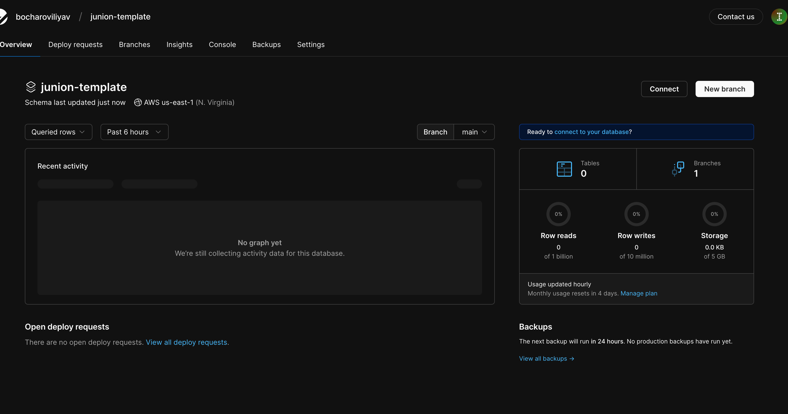
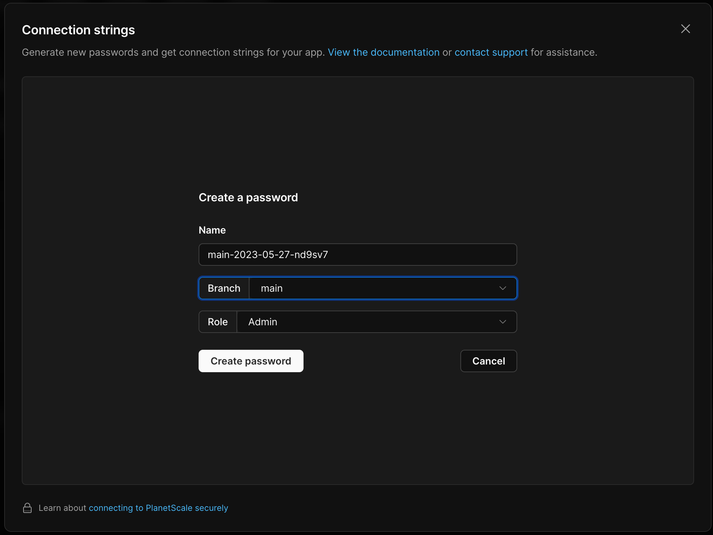
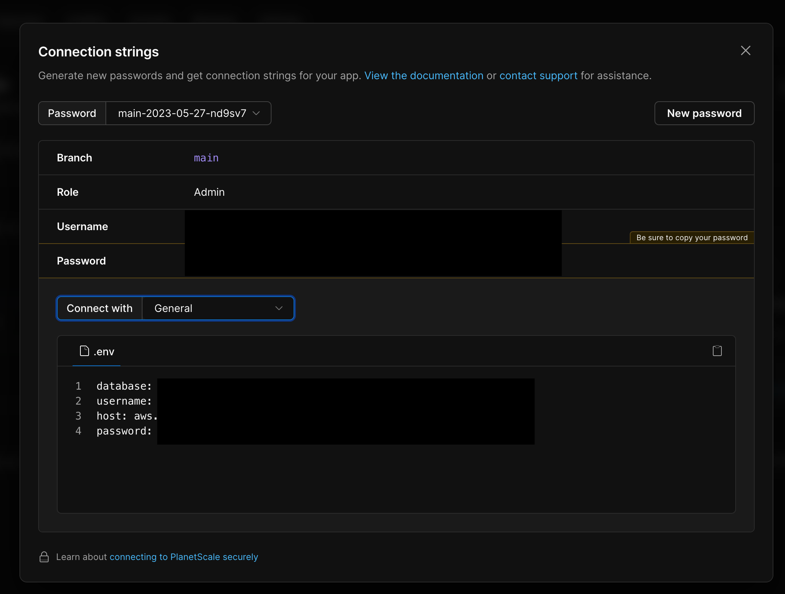
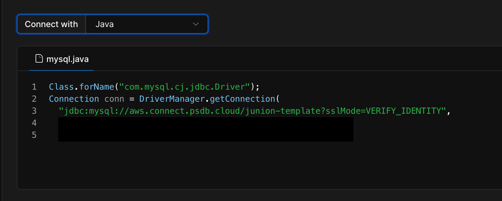
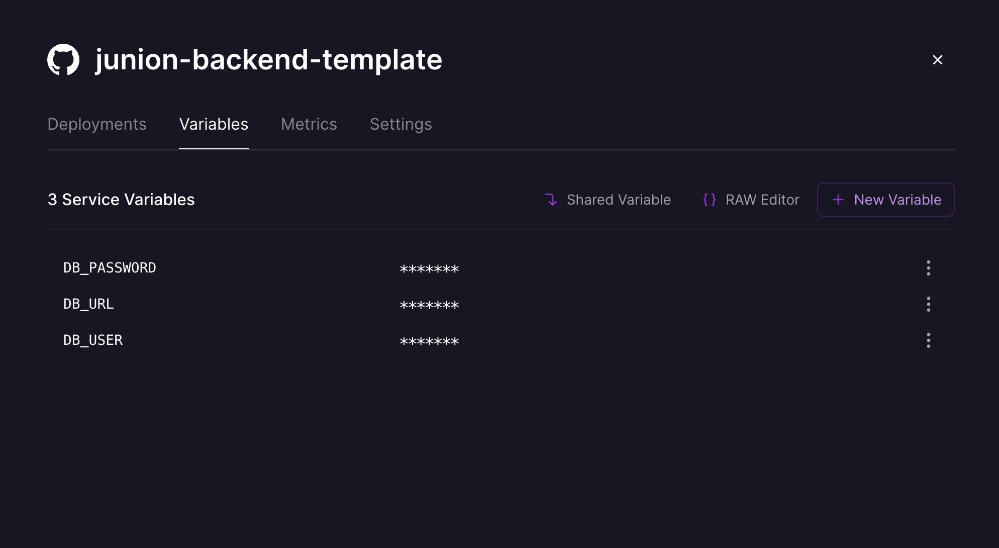
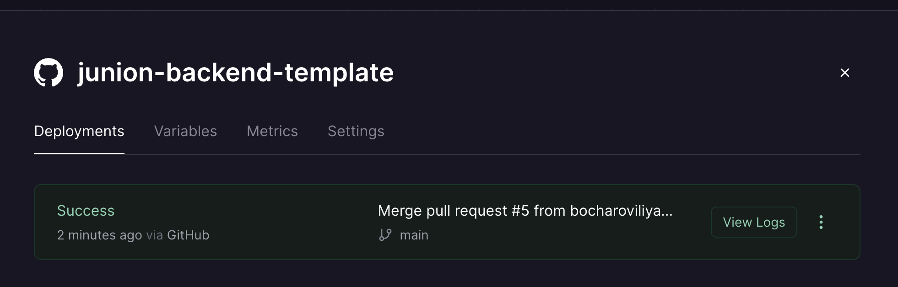
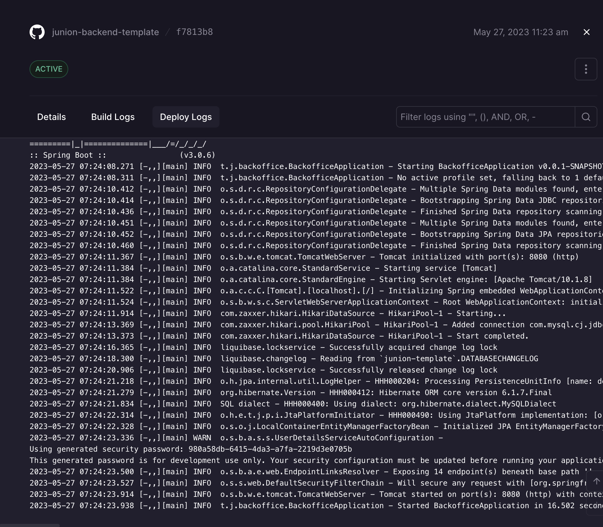
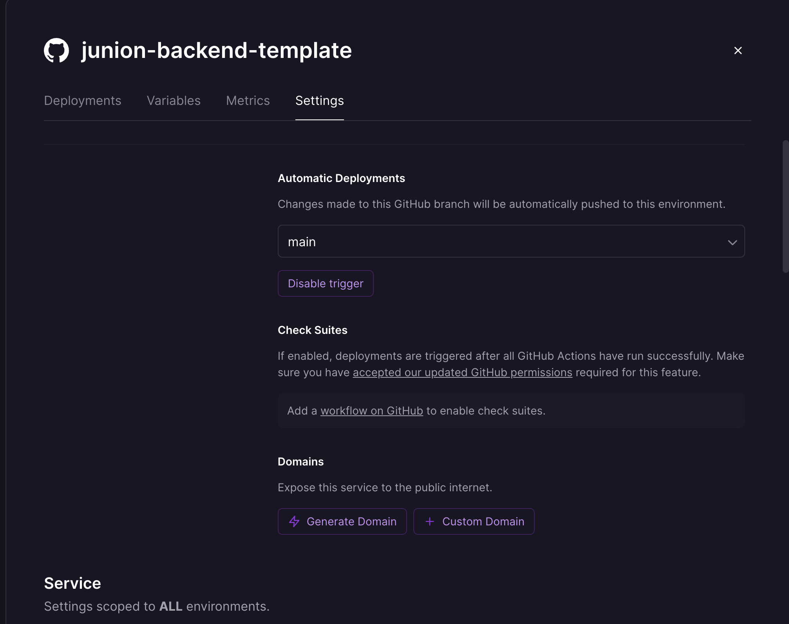
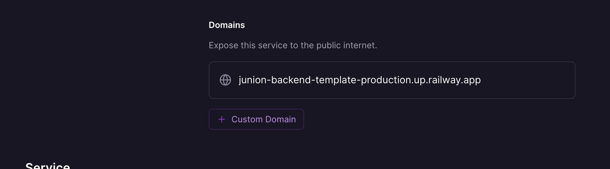

# This is the template for Spring Boot Java application

## The main technologies used in this template
* [Java 17](https://www.baeldung.com/java-17-new-features)
* [Maven](https://maven.apache.org/guides/getting-started/maven-in-five-minutes.html)
* [Spring Boot](https://spring.io/projects/spring-boot)
* [Testcontainers](https://www.testcontainers.org)
* [MySQL](https://docs.oracle.com/en-us/iaas/mysql-database/doc/getting-started.html)
 or [PostgreSQL](https://www.postgresql.org/docs/15/index.html)
* [OpenAPI](https://swagger.io/specification/)
* [OpenAPI Generator](https://openapi-generator.tech/docs/plugins/)
* [Swagger](https://swagger.io)
* [Checkstyle](https://checkstyle.org)
* [Spotbugs](https://spotbugs.github.io)
* [Mapstruct](https://mapstruct.org/documentation/installation/)
* [Liquibase](https://www.liquibase.org)
* [Lombok](https://projectlombok.org)
* [Micrometer](https://micrometer.io)
* [Wiremock](https://wiremock.org/docs/)
* [Junit 5](https://junit.org/junit5/)

## Docker
In this template both Dockerfile and docker-compose are present.
For building docker image from scratch please run
```shell
 docker build -t junion-template:1 .
```
docker-compose contains 2 version of databases. You can run it locally with:
```shell
docker compose up -d
```

## MySQL and PostgreSQL support
This project contain configurations and can work with MySQL and PostgreSQL. MySQL is used by default.
If you want change DB from MySQL to PostgreSQL you need:
* Comment in pom.xml
```xml
<dependency>
  <groupId>mysql</groupId>
  <artifactId>mysql-connector-java</artifactId>
  <version>${mysql.version}</version>
  <scope>runtime</scope>
</dependency>
```
and
```xml
<dependency>
  <groupId>org.testcontainers</groupId>
  <artifactId>mysql</artifactId>
  <scope>test</scope>
</dependency>
```

* Uncomment in pom.xml
```xml
<!--        <dependency>-->
<!--            <groupId>org.testcontainers</groupId>-->
<!--            <artifactId>postgresql</artifactId>-->
<!--            <scope>test</scope>-->
<!--        </dependency>   -->
```
and
```xml
<!--        <dependency>-->
<!--            <groupId>org.postgresql</groupId>-->
<!--            <artifactId>postgresql</artifactId>-->
<!--            <scope>runtime</scope>-->
<!--        </dependency>-->
```

* If you use docker compose, in docker-compose.yml uncomment
```yaml
  #      - DB_URL=jdbc:postgresql://db:3306/db
  #      - DB_USER=postgres
  #      - DB_PASSWORD=123

  #  db:
  #    image: 'postgres:15.2-alpine'
  #    container_name: db
  #    environment:
  #      - POSTGRES_USER=postgres
  #      - POSTGRES_PASSWORD=123
```

and comment
```yaml
      - DB_URL=jdbc:mysql://db:5432/postgres
      - DB_USER=postgres
      - DB_PASSWORD=123
      - 
    db:
      image: 'mysql:8.0.33'
      container_name: db
      restart: always
      environment:
       MYSQL_DATABASE: 'db'
       MYSQL_USER: 'mysql'
       MYSQL_PASSWORD: '123'
       MYSQL_ROOT_PASSWORD: '123'
      ports:
       - '3306:3306'
      expose:
       - '3306'
```

## Deployment 

Application can be hosted on any kind of Docker-compatible services. For example let's use
(Planetscale)[https://planetscale.com] for the serverless MySQL instance and
[Railway](https://railway.app) for application itself.
After completed registration let's configure our DB on Planetscale.

After few introductory steps you should see something like on screenshot above.
Click on Connect button and create password.

Then copy information for general profile

and feel free to switch to Java profile and copy jdbc connection URL


The next step is application deployment. Railway is easy-to-use platform, just connect your 
Github repo and Dockerfile should be founded and configured automatically.
But we still need add environment variables for DB connection. Click on application and switch to the 
Variables tab. After that, create three variables DB_URL, DB_USER, DB_PASSWORD and paste information 
from Planetscale.

Rerun deployment, it should be "green"

In the logs should be record about successful Tomcat starting.

Last but not least, let's create public domain name for our deployment. Go to the settings tab.

Click generate domain and that's it! 
